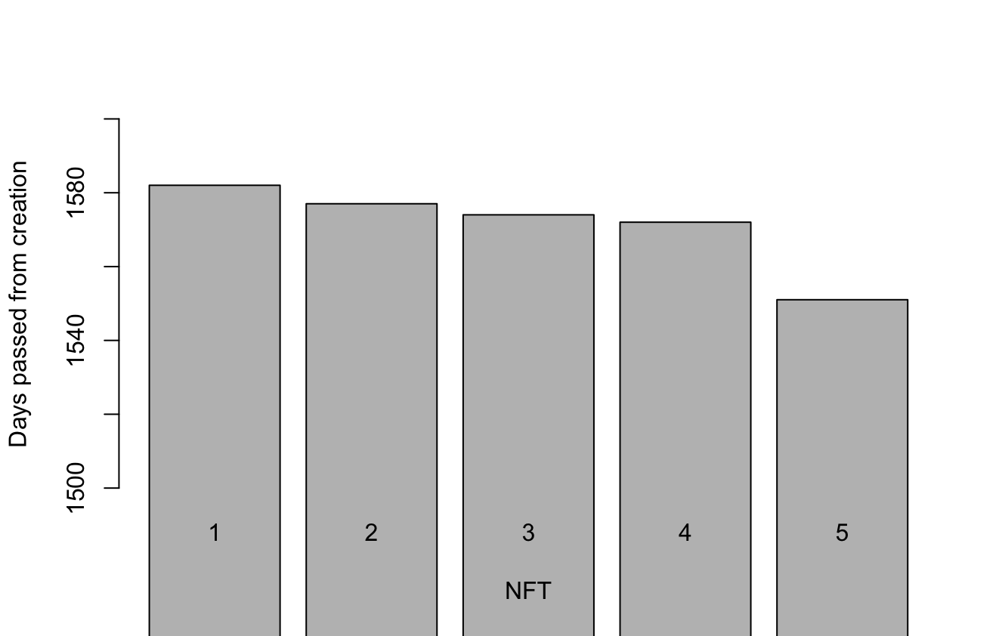

# Data Science on Blockchain in R
This repository includes a R project that takes NFT related metrics from Moralis API and visualize them.

Dependencies:
- R language version 4.0.5
- tidyverse
- httr
- jsonlite
- scales
- waffle
- ggrepel
- testthat


Building:
- will be implemented.

Testing:

Unit testing is used. Testing covers to have the correct number of answers from the API and the correct number of NFTs while plotting the barplot.

````
- Change current working directory to repository location.
- Run the script: "Rscript tests.R"
````


Install:
- will be updated.

How to use:
- Install required R language version from https://www.r-project.org
- install required packages from command line as:
install.package(PACKAGE_NAME)
- Change current working directory to repository location.
- Run the script: "Rscript main.R"


Plot that shows how many days passed from the creation of each NFT:


External Resources:
- https://docs.moralis.io/introduction/readme